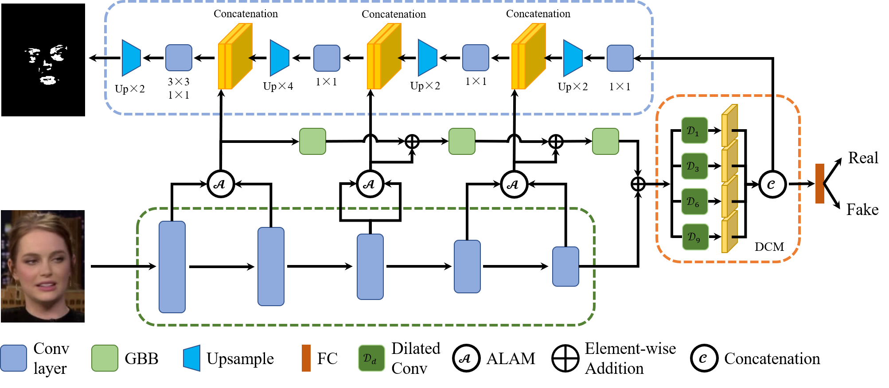

## SIFDNet: Face Forgery Detection and Localization Based on SSIM Error Maps

## Data Split

Look up the 'split' folder for detail.

## Preprocessing

More available preprocessing code can be found at:

- [FaceForensics++](https://gitee.com/joizhang/face-forensics-detection)
- [Celeb-DF](https://gitee.com/joizhang/celeb-df-detection)
- [Deepfake Detection Challenge](https://gitee.com/joizhang/dfdc-detection)

## Reference

[https://github.com/rwightman/pytorch-image-models](https://github.com/rwightman/pytorch-image-models/)

[https://github.com/selimsef/dfdc_deepfake_challenge](https://github.com/selimsef/dfdc_deepfake_challenge)
